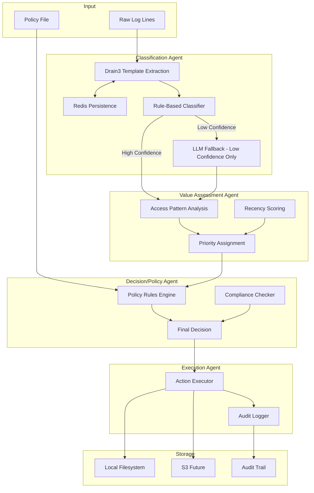
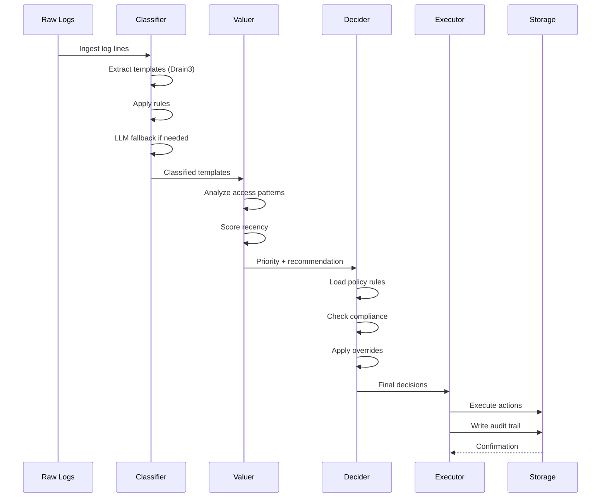
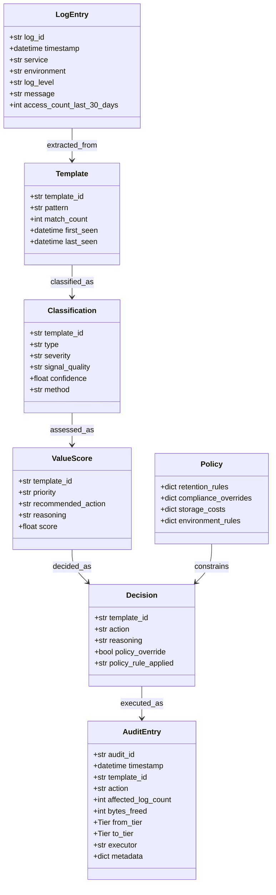
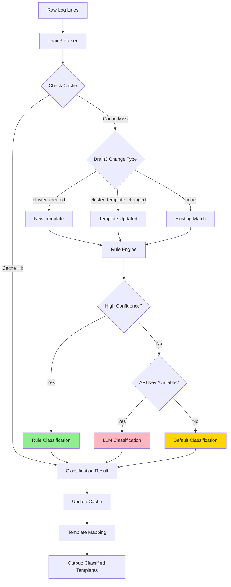
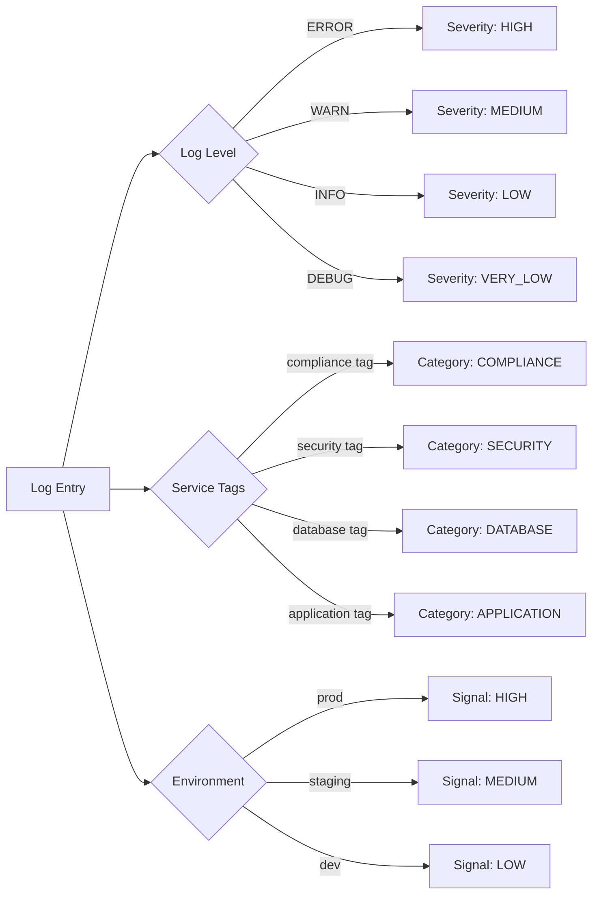
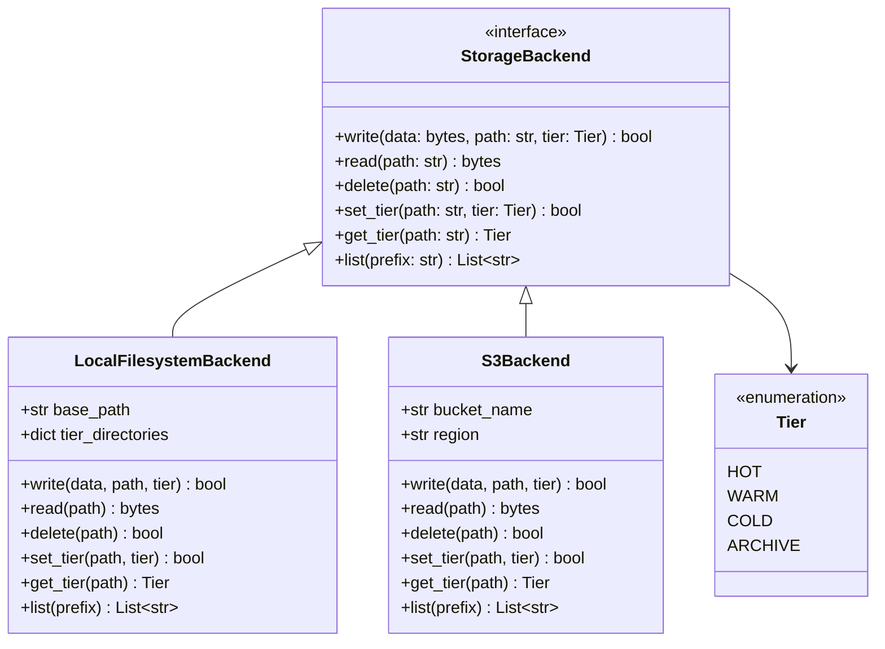
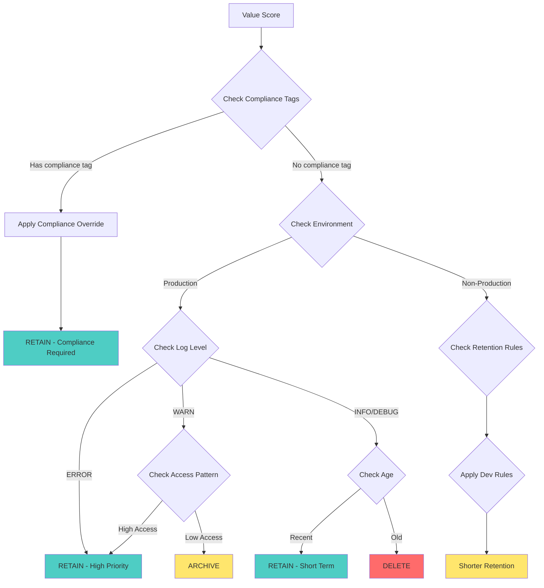
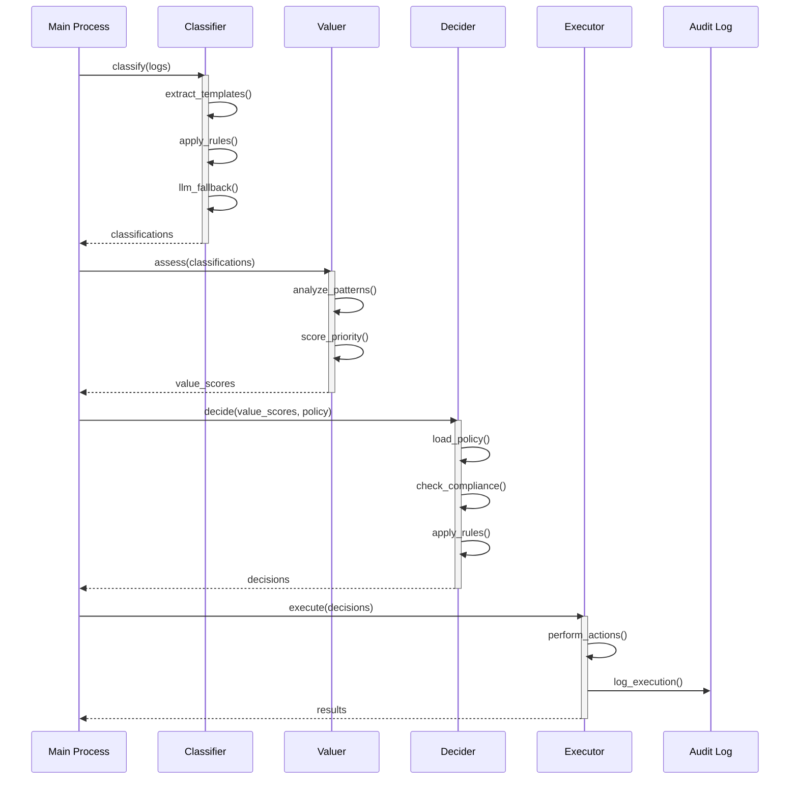

# System Architecture — Autonomous Log Cleanup Agent

## High-Level Flow

## Data Flow

## Data Models

## Classification Agent Detail

### Rule-Based Classification Logic

## Storage Backend Architecture

## Policy Decision Flow

## Agent Interaction Pattern

## Key Design Principles

### 1. Template-Level Processing
- **Why**: Reduces LLM calls from O(n) to O(unique_templates)
- **Impact**: 10x-100x cost reduction for typical log volumes
- **Trade-off**: Assumes logs with same pattern have same value

### 2. Rule-First Classification
- **Why**: Most logs follow predictable patterns
- **Coverage**: 80%+ of templates via rules
- **Fallback**: LLM only for genuinely ambiguous cases

### 3. Policy as Data
- **Why**: Non-engineers can modify retention rules
- **Format**: JSON with clear schema
- **Validation**: Pydantic ensures correctness

### 4. Immutable Audit Trail
- **Why**: Compliance and debugging
- **Storage**: Append-only log
- **Content**: Who, what, when, why for every action

### 5. Storage Abstraction
- **Why**: Easy migration from local to S3
- **Interface**: Common operations (read, write, delete, set_tier)
- **Future**: Add GCS, Azure Blob, etc.

## Performance Considerations

### Drain3 Template Extraction
- **Time Complexity**: O(n log m) where n=logs, m=templates
- **Memory**: O(m) for template storage
- **Optimization**: Batch processing, incremental updates

### LLM Classification
- **Bottleneck**: API latency (100-500ms per call)
- **Mitigation**: Only call for ambiguous templates
- **Caching**: Store classifications for reuse

### Storage Operations
- **Local**: Fast, limited by disk I/O
- **S3**: Network latency, but scalable
- **Optimization**: Batch operations, async writes

## Security & Compliance

### API Key Management
- Environment variable only
- Never logged or stored
- Graceful degradation without key

### Audit Trail
- Immutable append-only log
- Includes all decision context
- Tamper-evident timestamps

### Compliance Overrides
- Tag-based compliance detection (not service-name dependent)
- Flexible tagging system for compliance requirements
- Environment-specific policies
- Always logged in audit trail

## Future Enhancements

### Phase 2
- Real-time log streaming
- Incremental template updates
- Multi-tenant support

### Phase 3
- ML-based value prediction
- Anomaly detection
- Cost optimization dashboard

### Phase 4
- Distributed processing
- Multi-region storage
- Advanced compression strategies