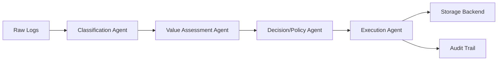

# Autonomous Log Cleanup & Archival Agent — Implementation Plan

## Overview
Building an agentic system for intelligent log management that reduces storage costs while maintaining observability and compliance. This is a hackathon MVP focusing on working end-to-end functionality.

## Architecture



### Agent Pipeline

1. **Classification Agent** (✓ Implementing in Phase 1)
   - Parses raw logs using Drain3 for template extraction
   - Rule-based classification (log level → severity, service → category)
   - LLM fallback for ambiguous templates only
   - Output: Classified templates + line-to-template mapping

2. **Value Assessment Agent** (Stub in Phase 1)
   - Assigns retention priority (high/medium/low)
   - Recommends action (retain/archive/delete/compress)
   - Factors: access frequency, log level, recency

3. **Decision/Policy Agent** (Stub in Phase 1)
   - Applies JSON policy file as guardrails
   - Compliance overrides by service
   - Environment-specific rules
   - Can override Value Agent decisions

4. **Execution Agent** (Stub in Phase 1)
   - Performs actions against storage backend
   - Writes immutable audit trail
   - Interface-based design for future S3 support

## Key Design Decisions

### Template-Level Processing
- Decisions made at template level, not line level
- Each log line carries template ID and inherits decision
- Dramatically reduces LLM calls and processing time

### Rule-First Approach
- Classification rules handle 80%+ of cases
- LLM only sees genuinely ambiguous templates
- Graceful degradation when API key missing

### Storage Abstraction
- `StorageBackend` interface for future extensibility
- `LocalFilesystemBackend` for MVP
- `S3Backend` stub for Phase 2

### Data Models (Pydantic)
```
LogEntry: Raw log with metadata
Template: Drain3 extracted pattern
Classification: Type/severity/signal-quality
ValueScore: Priority + recommended action
Decision: Final action with reasoning
AuditEntry: Immutable execution record
Policy: Retention rules + compliance overrides
```

## Project Structure

```
bobhackathon_rubikscube/
  log-agent/
    agents/
      __init__.py
      classifier.py          # ✓ Phase 1
      valuer.py             # Stub Phase 1
      decider.py            # Stub Phase 1
      executor.py           # Stub Phase 1
    models/
      __init__.py
      log_entry.py          # ✓ Phase 1
      template.py           # ✓ Phase 1
      classification.py     # ✓ Phase 1
      value_score.py        # ✓ Phase 1
      decision.py           # ✓ Phase 1
      audit_entry.py        # ✓ Phase 1
      policy.py             # ✓ Phase 1
    storage/
      __init__.py
      backend.py            # Interface ✓ Phase 1
      local_backend.py      # Implementation ✓ Phase 1
      s3_backend.py         # Stub Phase 1
    api/
      __init__.py
      main.py               # Stub Phase 1
    dashboard/
      __init__.py
      app.py                # Stub Phase 1
    data/
      sample_logs.json      # ✓ Phase 1
      sample_policy.json    # ✓ Phase 1
    tests/
      __init__.py
      test_classifier.py    # ✓ Phase 1
    __init__.py
    __main__.py             # CLI entrypoint ✓ Phase 1
    config.py               # Logging setup ✓ Phase 1
    pyproject.toml          # ✓ Phase 1
    README.md               # ✓ Phase 1
```

## Phase 1 Deliverables (Current)

### 1. Project Setup
- [x] Directory structure
- [x] pyproject.toml with uv
- [x] All __init__.py files
- [x] Logging configuration

### 2. Data Models
- [x] LogEntry: `{log_id, timestamp, service, environment, log_level, message, access_count_last_30_days}`
- [x] Template: Drain3 pattern with metadata
- [x] Classification: Type, severity, signal quality, confidence
- [x] ValueScore: Priority, action, reasoning
- [x] Decision: Final action with policy context
- [x] AuditEntry: Immutable execution record
- [x] Policy: Retention rules, compliance overrides, cost values

### 3. Classification Agent
- [x] Drain3 integration with default config
- [x] Rule-based classification:
  - Log level → severity mapping
  - Service name → category detection
  - Environment context
- [x] LLM fallback with Anthropic API:
  - Only for ambiguous templates
  - Graceful degradation without API key
  - Structured prompt for severity/category/signal-quality
- [x] Line-to-template mapping
- [x] Classification confidence scoring

### 4. Storage Backend
- [x] StorageBackend interface (read, write, delete, archive)
- [x] LocalFilesystemBackend implementation
- [x] S3Backend stub with docstrings

### 5. Sample Data
- [x] sample_logs.json: 6-8 entries covering:
  - ERROR/WARN/INFO/DEBUG levels
  - prod/dev environments
  - audit-service logs (compliance-sensitive)
  - Various services (api, database, auth, etc.)
  - Different access patterns

- [x] sample_policy.json:
  - Retention rules by log level
  - Compliance override for audit-service
  - Hot/cold storage costs
  - Environment-specific rules

### 6. CLI & Testing
- [x] CLI entrypoint: `python -m log_agent.classify data/sample_logs.json`
- [x] Output: Clean summary with stats
- [x] Basic test structure

### 7. Documentation
- [x] README with "Run the demo" section
- [x] One-command setup from clean checkout
- [x] Architecture overview
- [x] API key setup instructions

## Technical Constraints

### Code Quality
- ✓ Type hints on all public functions
- ✓ Docstrings on all public functions
- ✓ Use `logging` module (not print)
- ✓ Tag system logs with `system.` prefix
- ✓ No hardcoded API keys

### LLM Integration
- ✓ Anthropic API from `ANTHROPIC_API_KEY` env var
- ✓ Graceful fallback to rules-only mode
- ✓ Warning logged when API key missing
- ✓ Demo runs without API key

### Drain3 Configuration
- ✓ Use default parameters (depth, similarity)
- ✓ Configurable via config file for future tuning

## Next Phases (Future Prompts)

### Phase 2: Value & Decision Agents
- Implement Value Assessment Agent
- Implement Decision/Policy Agent
- Integration tests for agent pipeline

### Phase 3: Execution & API
- Implement Execution Agent
- Build FastAPI ingestion endpoint
- Query API for template/decision lookup

### Phase 4: Dashboard & S3
- Streamlit dashboard for visualization
- S3Backend implementation
- End-to-end demo with real storage

## Success Criteria for Phase 1

1. ✓ Project structure matches specification
2. ✓ All Pydantic models defined and validated
3. ✓ Classification Agent processes sample logs
4. ✓ Drain3 extracts templates correctly
5. ✓ Rule-based classification handles common cases
6. ✓ LLM fallback works for ambiguous templates
7. ✓ CLI runs and produces clean output
8. ✓ Demo works without API key (rules-only)
9. ✓ README has one-command setup
10. ✓ Code follows all constraints

## Running the Demo

```bash
# From clean checkout
cd bobhackathon_rubikscube/log-agent

# Install dependencies
uv pip install -e .

# Run classifier (works without API key)
python -m log_agent.classify data/sample_logs.json

# With API key for LLM fallback
export ANTHROPIC_API_KEY=your_key_here
python -m log_agent.classify data/sample_logs.json
```

Expected output:
```
Classification Summary
======================
Total log lines processed: 8
Unique templates extracted: 5
Rule-classified templates: 4 (80.0%)
LLM-classified templates: 1 (20.0%)

Template Details:
- Template 1: [ERROR] Database connection failed (severity: high, category: database)
- Template 2: [INFO] User login successful (severity: low, category: auth)
...
```

## Notes for Implementation

- Keep it simple — this is hackathon-scale
- Favor working demos over abstractions
- Clear separation of concerns
- Each agent is independently testable
- Storage backend is swappable
- Policy is data, not code
- Audit trail is immutable
- Template-level decisions scale better